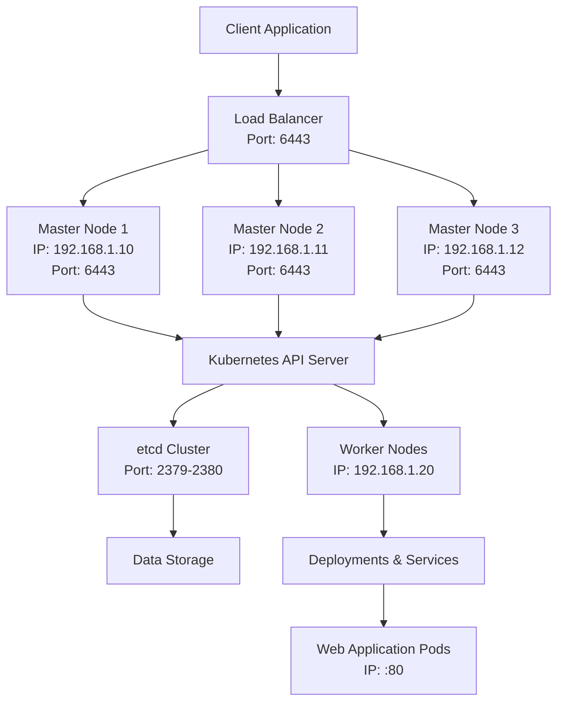

# Kubernetes Cluster Setup on RHEL with Load Balancer and Web Application

## Objective

The objective of this project is to deploy a Kubernetes cluster on Red Hat Enterprise Linux (RHEL) with a 
load balancer managing traffic to the master nodes and to deploy a web application within the cluster. The 
setup will ensure high availability of the Kubernetes control plane and functionality of the web 
application.



## Project Overview

1.  **Planning and Preparation**
    
    -   Define requirements and prepare the RHEL environment.
    -   Install Kubernetes components on master and worker nodes.
2.  **Install and Configure Kubernetes Control Plane**
    
    -   Set up multiple master nodes.
    -   Configure Kubernetes API Server, Controller Manager, and Scheduler.
3.  **Configure Worker Nodes**
    
    -   Set up worker nodes to join the Kubernetes cluster.
4.  **Set Up Load Balancer**
    
    -   Configure a load balancer to manage traffic to the master nodes.
5.  **Deploy Web Application**
    
    -   Create Kubernetes manifests for the web application.
    -   Deploy the application to the cluster.
6.  **Testing and Validation**
    
    -   Verify cluster functionality and high availability.
    -   Test web application deployment and access.
7.  **Documentation and Conclusion**
    
    -   Document the setup process and evaluate the benefits and challenges.

## Step-by-Step Configuration

### 1. Planning and Preparation

-   **Install RHEL**: Ensure RHEL is installed and updated on all nodes.
-   **Update System**:
    
    
    `sudo yum update -y` 
    

### 2. Install and Configure Kubernetes Control Plane

#### On Each Master Node

-   **Install Kubernetes Packages**:
    
    
    `sudo yum install -y kubeadm kubelet kubectl
    sudo systemctl enable kubelet` 
    
-   **Initialize the Kubernetes Cluster**: On the first master node (e.g., `192.168.1.10`):
    
    
    `sudo kubeadm init --control-plane-endpoint 192.168.1.100:6443 --upload-certs` 
    
    Save the output, including the `kubeadm join` command with the token and certificate key.
    
-   **Set Up kubeconfig**: On the first master node (`192.168.1.10`):
    
    
    `mkdir -p $HOME/.kube
    sudo cp -i /etc/kubernetes/admin.conf $HOME/.kube/config
    sudo chown $(id -u):$(id -g) $HOME/.kube/config` 
    
-   **Install a Network Plugin**: For example, using Calico:
    
    
    `kubectl apply -f https://docs.projectcalico.org/manifests/calico.yaml` 
    

#### On Additional Master Nodes

-   **Join the Cluster**: Use the `kubeadm join` command from the first master node’s output. For example, 
on `192.168.1.11`:
    
    
    `sudo kubeadm join 192.168.1.100:6443 --control-plane --certificate-key <certificate-key>` 
    

### 3. Configure Worker Nodes

-   **Install Kubernetes Packages**: On each worker node (e.g., `192.168.1.20`):
    
    
    `sudo yum install -y kubeadm kubelet kubectl
    sudo systemctl enable kubelet` 
    
-   **Join the Cluster**: Use the `kubeadm join` command from the master node setup output. For example:
    
    
    `sudo kubeadm join 192.168.1.100:6443 --token <token> --discovery-token-ca-cert-hash sha256:<hash>` 
    

### 4. Set Up Load Balancer

#### On the Load Balancer Node

-   **Install and Configure HAProxy**:
    
    
    `sudo yum install haproxy -y` 
    
    Edit `/etc/haproxy/haproxy.cfg`:
    
    
    ```
    frontend kubernetes_api
        bind *:6443
        default_backend kubernetes_master
    
    backend kubernetes_master
        balance roundrobin
        server master1 192.168.1.10:6443 check
        server master2 192.168.1.11:6443 check
        server master3 192.168.1.12:6443 check
    ``` 
    
-   **Start and Enable HAProxy**:
    
    
    `sudo systemctl start haproxy
    sudo systemctl enable haproxy` 
    

### 5. Deploy Web Application

#### Create Kubernetes Manifests

-   **Create a Deployment YAML File** (`web-app-deployment.yaml`):
    
    
    ```apiVersion: apps/v1
    kind: Deployment
    metadata:
      name: web-app
    spec:
      replicas: 2
      selector:
        matchLabels:
          app: web-app
      template:
        metadata:
          labels:
            app: web-app
        spec:
          containers:
          - name: web-app
            image: nginx:latest
            ports:
            - containerPort: 80``` 
    
-   **Create a Service YAML File** (`web-app-service.yaml`):
    
    ```apiVersion: v1
    kind: Service
    metadata:
      name: web-app-service
    spec:
      selector:
        app: web-app
      ports:
      - protocol: TCP
        port: 80
        targetPort: 80
      type: LoadBalancer``` 
    
-   **Deploy the Web Application**:
    
    
    `kubectl apply -f web-app-deployment.yaml
    kubectl apply -f web-app-service.yaml` 
    

### 6. Testing and Validation

-   **Verify Cluster Status**: On any master node:
    
    
    `kubectl get nodes` 
    
-   **Verify Web Application Deployment**:
    
    
    `kubectl get deployments
    kubectl get services` 
    
    Access the web application using the external IP of the `web-app-service`.
    
-   **Test Failover**: Stop the Kubernetes API server on one of the master nodes and ensure that the 
cluster remains available and operational through the load balancer.
    
-   **Test Web Application Functionality**: Access the web application via the load balancer and verify 
that it is serving content correctly.
    

### 7. Documentation and Conclusion

-   **Document Configuration**: Record all installation and configuration steps, including Kubernetes 
setup, load balancer configuration, web application deployment, and worker node integration.
-   **Evaluate Benefits**:
    -   **High Availability**: Ensures the Kubernetes control plane remains operational even if a master 
node fails.
    -   **Scalability**: Easily scale the number of master and worker nodes as needed.
    -   **Web Application**: Demonstrates the ability to deploy and manage web applications in the 
Kubernetes cluster.
-   **Challenges**:
    -   **Configuration Complexity**: Managing a multi-node Kubernetes setup with a load balancer can be 
complex.
    -   **Network Configuration**: Proper network setup is crucial for cluster communication, load 
balancing, and web application access.
